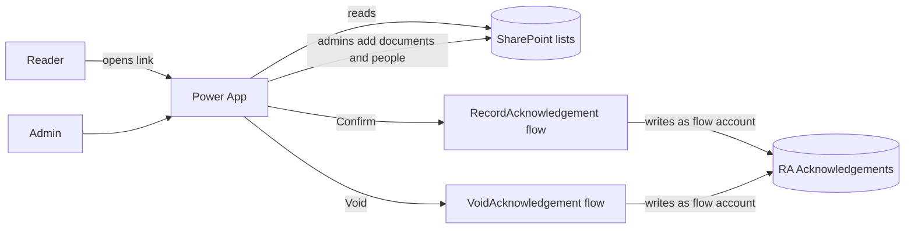

# Read and Acknowledge: Microsoft Power Apps version

The same idea as the web app in this repository, built on Microsoft 365: people open a link, tick
*"I have read and understood this document"* and confirm, and the organisation keeps a record of who
signed what and when.

This folder holds everything needed to build it in your own tenant: a script that creates the
SharePoint lists, step-by-step instructions for two Power Automate flows, and a screen-by-screen guide
with every Power Fx formula. Building it takes about two hours.

**Try it first:** `demo/index.html` is a clickable demo with sample data. Open it in a browser (no
setup needed). A side panel shows each flow run and what's written to the SharePoint records list.

## How it differs from the web app

| | Web app (Next.js) | Power App |
| --- | --- | --- |
| Sign-in | Its own accounts and passwords; admins send set-password links | People's existing Microsoft 365 accounts. Nothing to set up |
| Where data lives | PostgreSQL | Four SharePoint lists |
| Protecting records | Database trigger blocks edits and deletes | Only a flow account can write; version history keeps every change |
| Hosting | Vercel (or any Node.js host) | Microsoft 365. Nothing extra to host |
| Opens from | A web link | A web link, the Power Apps mobile app or Teams |
| Export | Download CSV in the app | SharePoint's **Export to CSV** on the records list |
| Cost | Hosting and database | Included in most Microsoft 365 business licences (see below) |

## How it fits together

| List | Holds | Who can write |
| --- | --- | --- |
| RA Documents | Name, description, version, due date, link, open or closed | Admins |
| RA Expected Signers | Who should sign which document | Admins |
| RA Acknowledgements | The audit trail: who, what, which version, when, the exact statement, device | The flow account only |
| RA Admins | Email addresses of admins | Site owners |

The flows work out who is calling from Microsoft 365, not from the app, and stamp the time
themselves. So nobody can sign for someone else or back-date a record, even with a modified copy of
the app. Admins also acknowledge documents like everyone else.

## Build it

1. [Set up SharePoint](docs/1-sharepoint-setup.md): a site, four lists and their permissions (script or by hand)
2. [Build the two flows](docs/2-power-automate-flows.md) in Power Automate
3. [Build the app](docs/3-build-the-app.md) in Power Apps Studio
4. [Share and test](docs/4-share-and-test.md), with a checklist

You need:

- A Microsoft 365 work account that can create SharePoint sites, Power Apps and Power Automate flows
- An account to own the flows: a service account is best, so the flows keep working if someone leaves
- For the setup script: PowerShell 7 and the PnP.PowerShell module (or create the lists by hand)

## Licences

Everything uses **standard connectors** (SharePoint, Office 365 Users, and Power Apps-triggered flows),
which are included in Microsoft 365 business and enterprise plans such as Business Basic, Business
Standard, E3 and E5. No Power Apps Premium licence is needed. Check with your IT team, as some
organisations restrict who can create apps and flows.

## Limits and trade-offs

- **Up to 2,000 people per document.** The app reads each document's list in one go, and Power Apps
  limits that to 2,000 rows (the *Data row limit* setting). The admin overview reads every document,
  so it also suits up to about 2,000 documents.
- **Everyone with access to the site can see the lists in SharePoint**, including who has signed what.
  The app itself only shows readers their own documents.
  - *Hiding other people's records:* remove readers' access to *RA Acknowledgements* and
    *RA Expected Signers*, and add a third flow that returns the caller's own documents to the
    *My documents* screen. This is more work, and slower, so it's left out by default.
- **Site owners can still edit records in SharePoint.** Version history shows any change and who made
  it. Keep the Owners group small.
- **No IP address is recorded.** Power Apps doesn't expose it. Each record stores the signer's
  Microsoft 365 identity, which is stronger evidence, plus the device and browser.
- **Close documents rather than deleting them.** Deleting a document leaves its acknowledgements in
  place, with the document's name, but the app no longer lists them.
- **Not tested in a live tenant from here.** The formulas and flow steps follow Power Apps' and Power
  Automate's documented behaviour, but run through the test checklist before relying on it.
